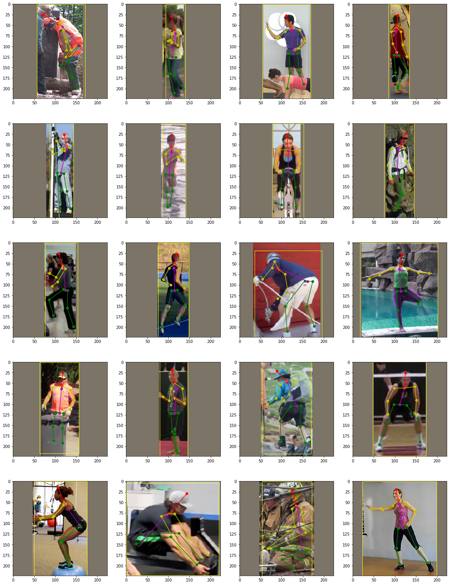

# MobilePose

MobilePose is a **Tiny** PyTorch implementation of single person 2D pose estimation framework. The aim is to provide the interface of the training/inference/evaluation, and the dataloader with various data augmentation options. And final trained model can satisfy basic requirements(speed+size+accuracy) for mobile device.

Some codes for networks and display are brought from:
1. [pytorch-mobilenet-v2](https://github.com/tonylins/pytorch-mobilenet-v2)
2. [Vanilla FCN, U-Net, SegNet, PSPNet, GCN, DUC](https://github.com/zijundeng/pytorch-semantic-segmentation)
3. [Shufflenet-v2-Pytorch](https://github.com/ericsun99/Shufflenet-v2-Pytorch)
4. [tf-pose-estimation](https://github.com/ildoonet/tf-pose-estimation) 
5. [DSNTNN](https://github.com/anibali/dsntnn)

## Requirements

- Python 3.6
- PyTorch 1.0
- DSNTNN 1.0

## Evaluation Results

|Model|Parmas(M)|Flops(G)|mAP(IoU=0.5:0.95)|mAP(IoU=0.5)|mAR(IoU=0.5:0.95)|mAR(IoU=0.5)|Google Drive|
|---|---|---|---|---|---|---|---|
|ResNet18(224x224)+DUC+DSNTNN|12.26|1.64|**0.682**|0.939|**0.797**|0.967|[50M](https://drive.google.com/open?id=17Z1zetIVDI4_8-ZoFgTRsjHtDpwGtjRT)|
|MobileNetV2(224x224)+DUC+DSNTNN|3.91|0.49|0.675|**0.949**|0.794|**0.971**|[16M]([https://drive.google.com/open?id=1Meyz8Jg2aRe8ijeBAY1uCRpV9l5OJoXl](https://drive.google.com/open?id=15Ihv1bVQv6_tYTFlECJMNrXEmrrka5g4))|
|ShuffleNetV2(224x224)+DUC+DSNTNN|2.92|**0.31**|0.615|0.916|0.748|0.955|[12M](https://drive.google.com/open?id=184Zg4E6HbbizPFYcELMXCd7mwWXdUd3U)|
|SqueezeNet1.1(224x224)+DUC+DSNTNN|**2.22**|0.63|0.584|0.921|0.723|0.958|[9M](https://drive.google.com/open?id=1RePeiBJHeHvmYTQ5vAUJHC5CstHIBcP0)|

<div align="center">
    
</div>

## Features

- [x] multi-thread dataloader with augmentations (dataloader.py)
- [x] training and inference (training.py)
- [x] performance evaluation (eval.py)
- [x] multiple models support (network.py)
- [x] ipython notebook visualization (demo.ipynb)
- [x] Macbook camera realtime display script (run_webcam.py)

## Usage

1. Training:
```shell
python training.py --model shufflenetv2 --gpu 0 --inputsize 224 --lr 1e-3 --batchsize 128 --t7 ./models/shufflenetv2_224_adam_best.t7
```
2. Evaluation
```shell
ln -s cocoapi/PythonAPI/pycocotools
cd cocoapi/PythonAPI && make

python eval.py --t7 ./models/resnet18_224_adam_best.t7 --model resnet18 --gpu 0
```

3. Web Camera Demo

```shell
python run_webcam.py --model squeezenet --inp_dim 224 --camera 0
```

## Contributors

MobilePose is developed and maintained by [Yuliang Xiu](http://xiuyuliang.cn/about/), [Zexin Chen](https://github.com/ZexinChen) and [Yinghong Fang](https://github.com/Fangyh09).

## License

MobilePose is freely available for free non-commercial use. For commercial queries, please contact [Cewu Lu](http://www.mvig.org/).